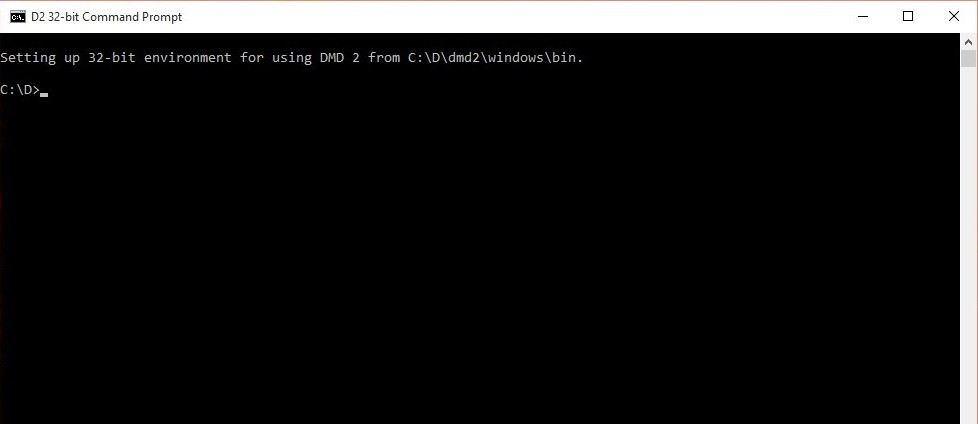
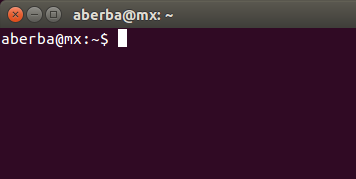
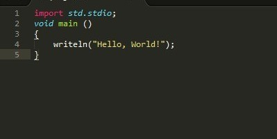
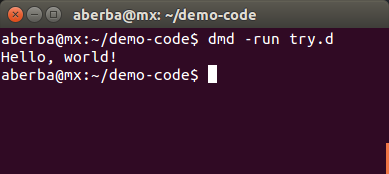

# Learn Coding: using D
> A mini book for learning computer programming completely from scratch using D programming language.


# Preface
This book is written to guide you to learn computer programming. I have put in effort to make it easy to understand for beginners. You will be taken through the basics and move to more advanced topics as you go further. You are encourage to follows along right from the start to understand more advanced topics in this book.

# Chapter 1: Introduction
In this chapter, you will be introduced to the concept of computer programming, how it works and you will finally write your first code. The various sections of this chapter are outlined below:

* Introduction to computer programming
* Setting up your development environment
* Writing your first code

## Introduction to computer programming
A computer is an electronic device, which takes instructions and carries them out. A computer program contains the instructions which tell the computer what to do. By writing the right program, you can tell a computer to do anything, _as long as it is capable_. A computer only understand __0s__ and __1s__. It uses a combination of 0s and 1s to represent a specific instruction. These combinations of 0s and 1s are difficult to write or understand.

To solve this problem, `computer programming languages` were invented. Programming languages are much easy to write or understand. A compiler is a program to convert a programming language into __machine code__ which a computer can understand. The process of writing code in a programming language is known as _coding_ and converting it to machine code is known as __compilation__ : the word __"compile"__ is the verb for compilation. 

There are so many different programming languages today. They all server the same purpose: to instruct a computer to perform a certain action. These languages vary in their design. Some are general purpose languages whilst other are designed for special purposes. Each programming language has its own special compiler for converting it into machine code.

[D](https://dlang.org) is one example of a general purpose programming language. It was designed to be used for doing so many things (web applications, games, desktop applications, operating systems, robortics, real-time communication systems, etc). Learning D is fairly straight forward even for beginners. In this book, you will learn how to begin computer programming using the D programming language.

## Setting up your development environment
To begin programming in D your need to have the following two (2) softwares:

1. __A Text Editor__: A text editor is a software used from writing code. One example of a text editor is Sublime which you can download at __sublimetext.com__.
2. __D compiler__: We will use the D compiler to convert the code we will write to machine code. Download the D compiler at __dlang.org/download__. Make sure you select __DMD (the official D compiler)__ and download the version for your Operating System (Windows, Linux, macOS, BSD, etc).

After downloading these two softwares, install all onto your computer. After completing this process, your are ready to begin programming! From this point onwards, we will be using the __command-line__ (also know as Command Prompt or Terminal) to run DMD (the D compiler) to compile the code we will write to machine language. Instructions on how to launch the command-line for various Operating Systems is illustrated as follows:

#### Windows
If you are on Windows, open Start Menu and search for __D2 32-bit Command Prompt__. Open it to launch a command prompt on your desktop as shown in the screenshot below:


D2 32-bit Command Prompt in Windows

Create a new folder named `code-demo` in your `C:\` drive. All the code we will write should be stored in this folder (`C:\code-demo`). Navigate to this folder in the command prompt you launched by entering the command `cd C:\code-demo` (press `Enter` on your keyboard to run command). Remember to _always_ make sure you navigate to `C:\code-demo` whenever you first launch __D2 32-bit Command Prompt__.

#### Linux and macOS
The command-line program for most Linux Operating Systems and macOS  is called __Terminal__. Search for "Terminal" from the applications installed and launch.


Terminal in Ubuntu Linux

The code we will write should be stored in a newly created folder `code-demo` in your Home folder. Navigate to this folder by entering the command `cd ~/code-demo` in your command-line. Remember to _always_ make sure you navigate to `code-demo` whenever you first launch __Terminal__.

> #### Installing the D compiler other Operating Systems
> There are so many Operating Systems which do not have their installer on the [D language website](https://dlang.org/download). Some of them require building the compiler from its source  code on your own. Approach for some of them are as follows:
> * Slackware: Slackware uses Slackbuild script to create packages. You can obtain the slackbuild script for the D compiler at https://slackbuilds.org/repository/14.2/development/dmd/
> * 

## Writing your first code
Open Sublime text editor and create a new file by clicking on `File > New File `. Save the file by clicking on `File > Save`. This will bring up a file dialog for you to select a location where your want to save the file. On Windows, save it at `C:\code-demo` folder. For Linux and macOS users, save it in the `code-demo` folder in Home. Make sure you save the file as `hello.d`. 

> #### File naming conventions
> Any file containing D code _must_ have a name that ends with `".d"`. The `".d"` is the extension (format) of the file. File names _must only_ contain numbers, letters, or underscore (`"_"`) and _should not have_ a space within its. All letters must be in lower-case (small letters). 

> Some invalid style of naming D files include `"d program.d"`, `"d program .d"` and "`dprogram"`.
> 
> Valid styles include `"d_program.d"`, `"dprogram.d"` and `"d_program_01.d"`.
> 
> __NOTE:__ Although I stated you should save the file as `hello.d`, you are free to save it with any name you want as long as it conforms to the file naming conventions stated above.

After saving the new file, type the following code _exactly as it appears_ into it:

```d
import std.stdio;
void main()
{
    writeln("Hello, world!");
}
```

The code should look similar to the screenshot below when typed in Sublime:



You can now save the code to the file by clicking `File > Save` or using the keyboard shortcut `Ctrl + S` in Sublime. Enter the following command in your command-line compile and run the code using DMD:

```sh
dmd -run hello.d
```
This command tells DMD to look for a file named `hello.d`, compile and run it. You may also choose to compile it to machine code first using:

```sh
dmd hello.d
```
This will generate a program called `hello.exe` on Windows or just `hello` on Linux and macOS. On Windows, enter with the command:

```sh
hello.exe
```

or on Linux and macOS, enter:

```sh
./hello
```

This should print `"Hello, world!"` in the command-line just like the previous command but this time, you also have the generated program at the location of the D source file.

> ### Terms
> * Any file which contains code in any programming language is called a __source file__. The whole code for a program which may be made up of several source files in known as the __source code__.


If you typed the code correctly, saved it into the new file and typed the command correctly, DMD should compile and run the code we wrote above. This should print the text `"Hello, world!"` in the command-line as shown in the screenshot below;

 
Demo code in Terminal

Congratulations! You have written your first program in D.

> ### Getting all source code for examples in this book
> You can access all the code used in this book at https://github.com/aberba/learn-coding within the `examples` folder. The examples source code is organised placed into various folders in sequence depending on the __Chapter__ in the book within which it was demonstrated. 
> For example, the `hello.d` code we just wrote will be placed in the `chapter_01` folder in `examples` and the file will be named as `example_01_hello.d`. The next example in this chapter will be saved in a file with its name prefixed with `example_02_`. The same pattern applies to source code for all examples in this book.


# Chapter 2: Learning the basics of D
